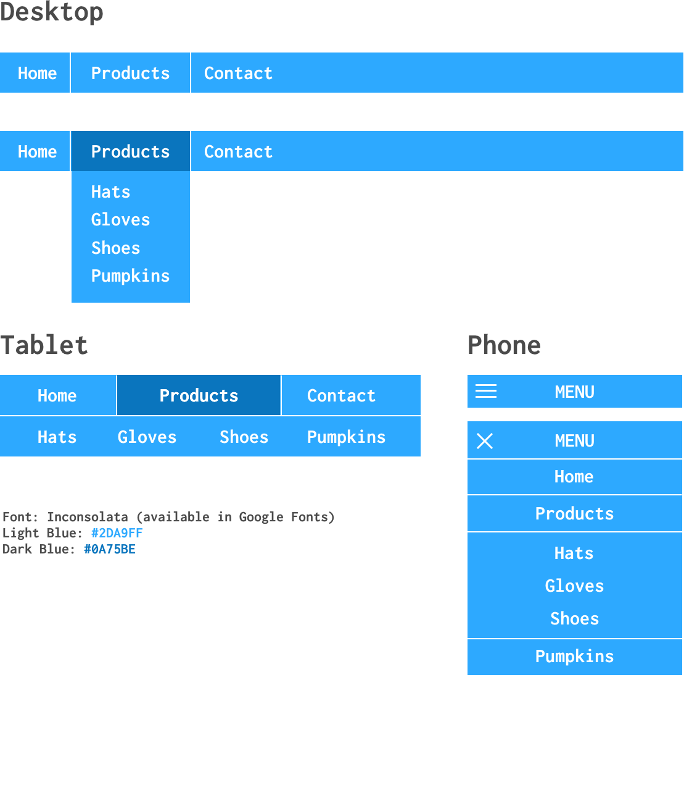

## Assignment 03
Assigned on: April 18, 2018

Due: April 30, 2018

## Complete The Following
* Read Chapters 3 & 4 of Mastering Responsive Web Design.
* Build a responsive navigation menu using the included design assets.
* Plan on participating in a public code review on Google Hangouts on May 1st.

## Style Guidelines
* Use 4 spaces for indentation.
* Always indent nested HTML tags
* Always indent nested CSS/Sass/SCSS.
* You may use either Sass or SCSS syntax.

## Grading
* Coded design accurately matches design asset (in Chrome): 20 pts.
* Proper use of HTML5 tags: 5 pts.
* Use of Mixins to generate valid media queries: 15 pts.
* Handles at least 3 break points: 5 pts.
* Meets style guidelines defined above: 5 pts.

Total: 50 pts.