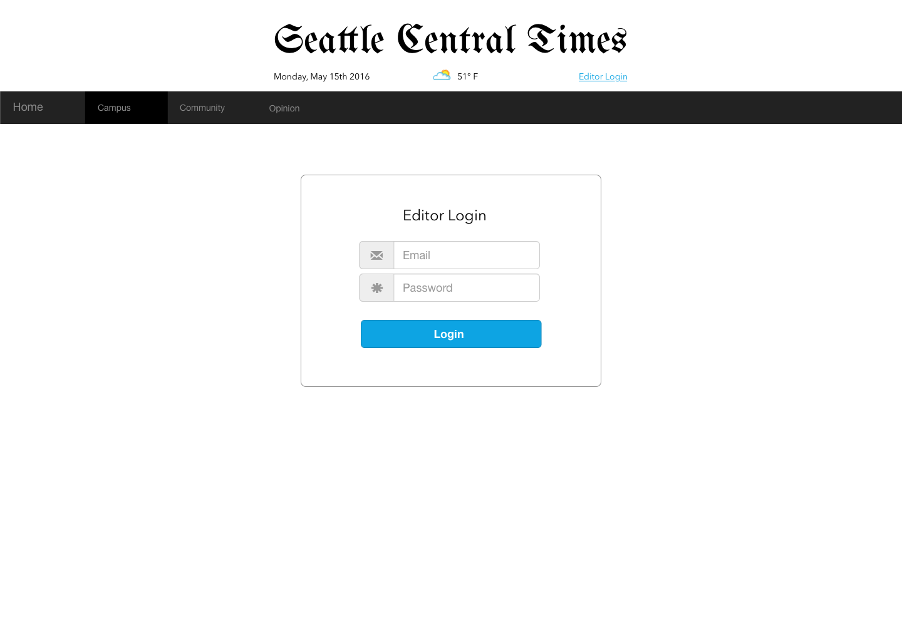
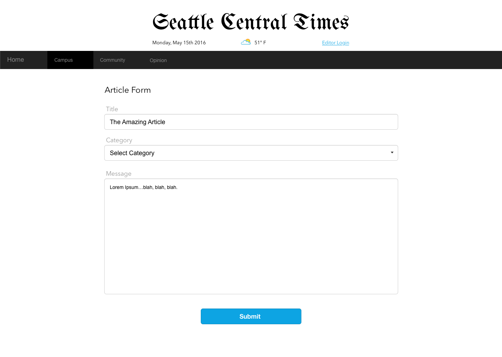
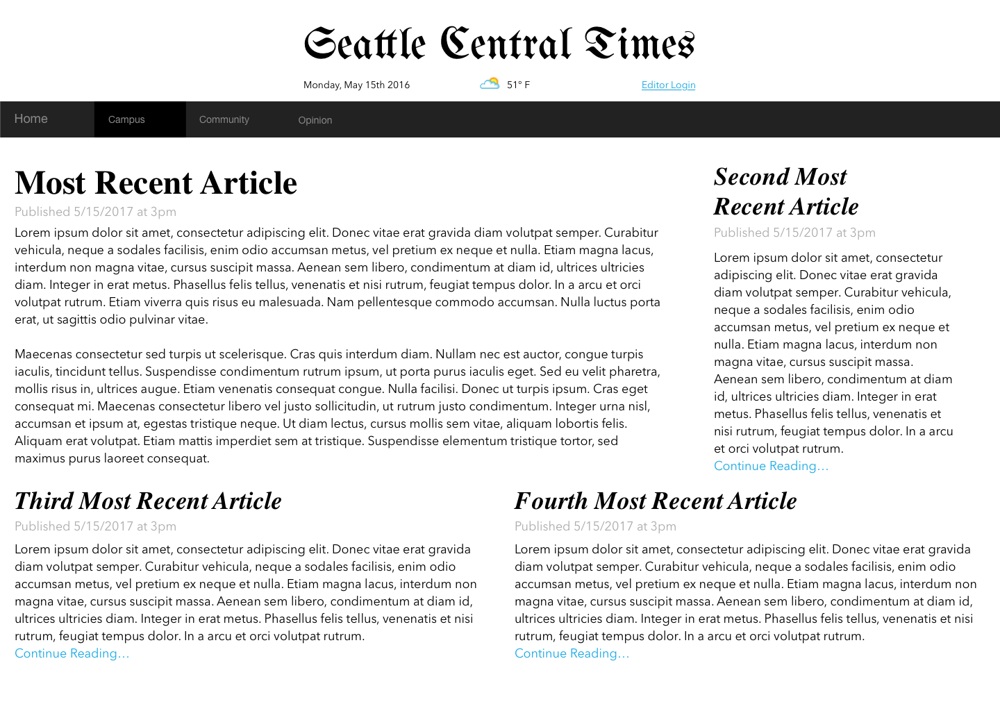

## Assignment 04
Assigned on: May 15th, 2017

Due: June 12th, 2017

## Complete The Following
* Build a responsive web application as your final project.
* The web application must intelligently handle mobile, tablet, and dekstop viewports.
* Your application must have a responsive "list view" that shows a list of dynamically generated content.
* Your application must have a responsive "detail view" that displays the content of a particular, dynamically generated item.
* The web application must use authentication.
* There must be a form whereby authenticated users can generate content.
* The nature of the content is up to you, but it must have at least two distinct fields.
* Participate in a public code reviews and presentations on June 12th and June 14th.
* You may either chose the "Newspaper" project outlined below, or develop your own project that meets these requirements.

## Style Guidelines
* Use 4 spaces for indentation.
* Always indent nested HTML tags
* Always indent nested CSS/Sass/SCSS.
* You may use either Sass or SCSS syntax.

## Grading
* Follows good design principles (and/or matches the newspaper design): 20 pts.
* Proper use of HTML5 tags: 10 pts.
* Use of Sass and Sass Mixins to generate styling code that is to modify: 10 pts.
* Handles any common viewport from mobile to desktop: 10 pts.
* Properly peforms authentication: 10 pts.
* Allows generation of dynamic content: 10 pts.
* Responsive "list" view of dynamic content: 10 pts.
* Responsive "detail" view of dynamic content: 10 pts. 
* Meets coding style guidelines defined above: 10 pts.

Total: 100 pts.

## Newspaper Design
You may use this design as is, or modified.

### Authentication View

### Form View

### List View

### Detail View

